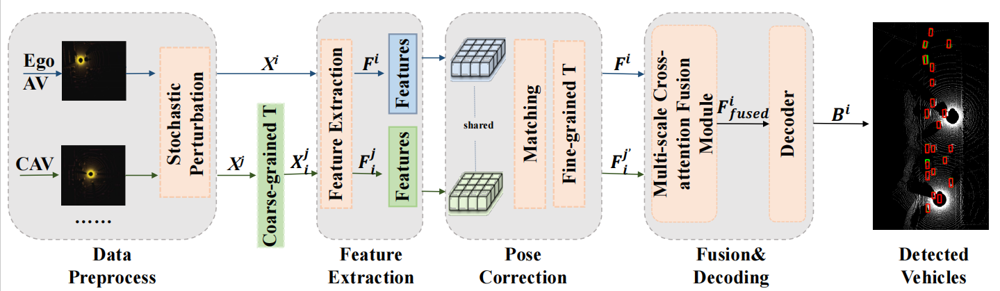

# ERCP
Boosting Vehicle-to-Vehicle Collaborative Perception in Bird's-Eye View by Attentive Feature Fusion and Robust Pose Correction


> [**Boosting Vehicle-to-Vehicle Collaborative Perception in Bird's-Eye View by Attentive Feature Fusion and Robust Pose Correction**](https://doi.org/10.1109/LRA.2026.3653278),            
> Hong Zhou\*, Chenyang Lu, Liang Li, Xiangchao Meng, Feng Shao and Qiuping Jiang 

# Abstract
Collaborative perception enables Connected Autonomous Vehicles (CAVs) to share sensory data, and therefore presents a promising path towards long-range robust environmental understanding by overcoming individual perception limitations such as occlusions. The core challenge of collaborative perception lies in the precise spatial alignment of shared features and their effective fusion. To address this, we propose a novel framework named Effective and Robust Collaborative Perception (ERCP), which is designed to enhance feature fusion with strong robustness against CAV pose errors. Specifically, the robustness is improved by a two-stage coarse-to-fine Pose Correction Module (PCM) that performs feature spatial alignment, and is further boosted by the proposed perturbative training mechanism. Furthermore, a Multi-scale Cross-attention Fusion Module (MCFM) effectively aggregates aligned Bird's-Eye View (BEV) features from multiple CAVs, and leverages cross-attention among different scales to create a comprehensive representation for downstream perception tasks. Extensive evaluations on the OPV2V and V2V4Real datasets demonstrate that ERCP achieves state-of-the-art performance in the collaborative vehicle detection task in BEV.

<!-- # Note
The code will be released after the publication of the subsequent work. -->

## Installation
```bash
# Setup conda environment
conda create -f Env.yaml

conda activate opencood

# spconv 2.0 install, choose the correct cuda version for you
pip install spconv-cu113

# Install dependencies
pip install -r requirements.txt
# Install bbx nms calculation cuda version
python v2xvit/utils/setup.py build_ext --inplace

# install v2xvit into the environment
python setup.py develop
```

## Data Downloading
All the data can be downloaded from [google drive](https://drive.google.com/drive/folders/1dkDeHlwOVbmgXcDazZvO6TFEZ6V_7WUu). If you have a good internet, you can directly
download the complete large zip file such as `train.zip`. In case you suffer from downloading large files, we also split each data set into small chunks, which can be found 
in the directory ending with `_chunks`, such as `train_chunks`. After downloading, please run the following command to each set to merge those chunks together:
```python
cat train.zip.part* > train.zip
unzip train.zip
```

## Getting Started

### Note:

- Models and parameters should be trained in perfect environment and tested in noisy environment.

### Test with pretrained model
To test the pretrained model of ERCP, first download the model file from [google url](https://drive.google.com/drive/folders/1eweBGryHUe3uQZ2RutiKsOm5puEoGngF?usp=sharing) and
then put it under v2xvit/logs/opv2v_ercp. Change the `validate_path` in `v2xvit/logs/opv2v_ercp/config.yaml` as `/data/opv2v/test`.

To test under perfect setting, change `add_noise` to false in the v2xvit/logs/opv2v_ercp/config.yaml.

To test under noisy setting in our paper, change the `noise_settings` as followings:
```
noise_setting:
  add_noise: True
  args: 
    pos_std: 1
    rot_std: 1
    pos_mean: 0
    rot_mean: 0
```
Eventually, run the following command to perform test:
```python
python v2xvit/tools/inference.py --model_dir ${CHECKPOINT_FOLDER}
```
Arguments Explanation:
- `model_dir`: the path of the checkpoints, e.g. 'v2xvit/logs/opv2v_ercp' for ERCP testing.

### Train your model
ERCP uses yaml file to configure all the parameters for training. To train your own model
from scratch or a continued checkpoint, run the following commands:

```python
python v2xvit/tools/train.py --hypes_yaml ${CONFIG_FILE} [--model_dir  ${CHECKPOINT_FOLDER} --half]
```
Arguments Explanation:
- `hypes_yaml`: the path of the training configuration file, e.g. `v2xvit/hypes_yaml/where2comm_transformer_multiscale_resnet.yaml` for  training.
- `model_dir` (optional) : the path of the checkpoints. This is used to fine-tune the trained models. When the `model_dir` is
given, the trainer will discard the `hypes_yaml` and load the `config.yaml` in the checkpoint folder.
- `half`(optional): if specified, hybrid-precision training will be used to save memory occupation.

## Citation
 If you are using our ERCP for your research, please cite the following paper:
 ```bibtex
@article{zhou2026boosting,
title={Boosting Vehicle-to-Vehicle Collaborative Perception in Bird's-Eye View by Attentive Feature Fusion and Robust Pose Correction},
author={Zhou, Hong and Lu, Chenyang and Li, Liang and others},
journal={IEEE Robotics and Automation Letters},
volume={11},
number={2},
pages={2330--2337},
year={2026},
doi={10.1109/LRA.2026.3653278}
}
```

## Acknowledgment
ERCP is built upon [OpenCOOD](https://github.com/DerrickXuNu/OpenCOOD) and [V2X-ViT](https://github.com/DerrickXuNu/v2x-vit). 
